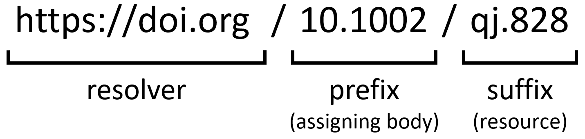

What is a persistent identifier?
--------------------------------

Persistent identifiers (PIDs) are required to address the *F* in FAIR. They are used to identify digital resources using a unique and standardized label. PIDs are persistent, meaning that we will be able to find the data long into the future, even if the actual location (e.g. URL) or name of the resource changes. Well known PIDs are the [digital object identifiers](https://en.wikipedia.org/wiki/Digital_object_identifier) (DOI) and the [Handle System](https://en.wikipedia.org/wiki/Handle_System). In fact, a DOI is a type of Handle System handle.

Assigning a PID to your data makes sense. It will make the data easier to find, promotes reproducibility and reuse, makes it possible to track the impact, and enables long-term availability of the data. Remember that we said that data should be *FAIR* to computers? By assigning PIDs to our datasets (and publications), large networks of linked data and information can be created automatically.

> ## Anatomy of a DOI
> A DOI takes the form of a string with two parts, a prefix and a suffix, divided by a slash. Usually, a prefix corresponds to the publisher, and the suffix to the resource.
> 
{: .callout}

> ## Exercise
> - Where does the above linked DOI point to?
> - Do you think this DOI will still be valid in 50 years?
> - Who is responsible to update the DOI if you get a dead link?
> - What do you think should happen if the journal ceases to exist?
{: .challenge}

Which data need a PID?
----------------------

Ideally, all research objects (publications, software, observations, model output, figures, etc.) have PIDs, so that the entire workflow can be traced through the links between them. Additionally, it often makes sense to make separate entries for raw and processed data.

Making raw data available enables other researchers to re-use your data, and to develop their own models and ideas. Making the processed data available serves to promote reproducibility, and enables others to build upon your results. In climate science the large intercomparison projects are a prime example of the latter.

One of the challenges is how to deal with 'dynamic data', which is also highly relevant for climatological data. How do you make PIDs for data that is continuously evolving? [For the CMIP6 project](https://datascience.codata.org/articles/10.5334/dsj-2017-030/), a pragmatic approach was taken, consisting of a global PID for the entire, evolving data superset, and specific PIDs for citing specific subsets.

> ## Discussion
> Consider your own use case (that you selected in episode 1):
> - Is there any input data? Does it have a DOI?
> - Is the output data part of a (large) project that has some central policy on DOIs (such as CMIP6?)
> - Did you (or do you plan to) make a DOI available for the (anticipated) output data?
> - Why/Why not?
{: .challenge}

How do you get a PID?
---------------------

Getting a PID (usually a DOI) for your data is as easy as publishing your data to a data archive. After the upload, a PID is automatically assigned. Note that just getting a PID is not all for making the data FAIR. Without metadata it will still be difficult to find the data. That's why many data archives make it easy to add metadata, such as a list of authors, related projects, linked publications or other related items.

Below you will find a list of resources to find a trusted or recommended repository.

- [OpenAIRE](https://explore.openaire.eu/participate/deposit/learn-how):
Find the appropriate repository to deposit your research products of any type (publication, data, software, other) or to include in your data management plan. Search and browse for OpenAIRE compliant repositories registered in OpenDOAR and re3data. OpenAIRE is a EC funded network of Open Access repositories, archives and journals that support Open Access policies.

- [Zenodo](https://zenodo.org):
Zenodo is a general-purpose open-access repository developed under the European OpenAIRE program and operated by CERN. It allows researchers to deposit data sets, research software, reports, and any other research related digital artifacts
General purpose open-access repository developed

- [FAIRsharing catalogue of databases](https://fairsharing.org/databases/):
FAIRsharing is a web-based, searchable portal of three interlinked registries, containing both in-house and crowdsourced manually curated descriptions of standards, databases and data policies, combined with an integrated view across all three types of resource.

- [Registry of Research Data Repositories (re3data.org)](https://www.re3data.org/):
re3data.org is an Open Science tool that offers researchers, funding organizations, libraries and publishers an overview of existing international repositories for research data.

- [European Research Council (ERC) Open Access](https://erc.europa.eu/funding-and-grants/managing-project/open-access):
ERC curated webpage on policies on open access and data storage, including a list of recommended repositories.

## Further Reading
- <https://www.go-fair.org/fair-principles/f1-meta-data-assigned-globally-unique-persistent-identifiers/>
- <https://librarycarpentry.org/lc-fair-research/02-findable/index.html>
- <https://datascience.codata.org/articles/10.5334/dsj-2017-030/>


